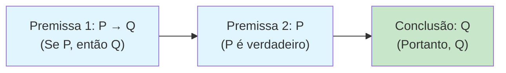

## 1. Conceitos Fundamentais

### Premissa
Uma **premissa** é uma afirmação ou conjunto de afirmações que servem como **fundamento** para uma conclusão. Em um argumento, as premissas são as "evidências" que sustentam o raciocínio. Podem ser fatos observados, dados estatísticos, resultados de testes ou suposições aceitas temporariamente.

> **Dica de identificação:** Premissas frequentemente começam com expressões como *"porque"*, *"já que"*, *"uma vez que"*, *"considerando que"*, *"os dados mostram que"*, *"evidências indicam que"*.

### Conclusão
A **conclusão** é a afirmação que o autor busca estabelecer como verdadeira com base nas premissas. É o ponto central do argumento — aquilo que se quer que o leitor aceite.

> **Dica de identificação:** Conclusões costumam ser introduzidas usando *"portanto"*, *"logo"*, *"consequentemente"*, *"assim"*, *"desse modo"*, *"podemos concluir que"*, *"logo, é razoável afirmar que"*.

### Tese x Hipótese
- **Tese:** É a posição central que se defende. É ampla e pode ser justificada por vários argumentos. Em ciência de dados, a tese pode ser algo como *"o modelo de regressão logística é mais adequado para este problema"*.
- **Hipótese:** É uma afirmação mais específica e testável, frequentemente usada como ponto de partida para uma análise. Em estatística, a hipótese nula ($H_0$) e a hipótese alternativa ($H_1$) são exemplos clássicos.

### Argumento vs. Justificativa
- **Argumento:** É a estrutura completa que liga premissas a uma conclusão. É o "esqueleto lógico" do raciocínio.
- **Justificativa:** É o conjunto de razões (premissas) que sustentam uma afirmação. A justificativa é, em essência, o conjunto de premissas de um argumento.

## 2. Modus Ponens — O Esquema Dedutivo Fundamental

O **Modus Ponens** (do latim "modo que afirma") é o esquema dedutivo mais básico e importante da lógica proposicional. Ele segue a seguinte estrutura:

$$
\begin{align}
P &\rightarrow Q \quad \text{(Se P, então Q)} \\
P &\quad \quad \quad \text{(P é verdadeiro)} \\
\hline
\therefore Q &\quad \quad \text{(Portanto, Q é verdadeiro)}
\end{align}
$$

Em palavras: se sabemos que "P implica Q" e sabemos que "P é verdade", então podemos concluir com certeza que "Q é verdade".

### Exemplo em contexto de Machine Learning

| Elemento | Exemplo |
|---|---|
| Premissa 1 ($P \rightarrow Q$) | Se a acurácia do modelo A é significativamente maior que a do modelo B, então o modelo A é preferível. |
| Premissa 2 ($P$) | A acurácia do modelo A é significativamente maior que a do modelo B. |
| Conclusão ($Q$) | O modelo A é preferível. |

### Por que isso importa para seus notebooks?

Cada vez que você escreve em um notebook de análise de dados algo como *"Como o p-valor é menor que 0,05, rejeitamos a hipótese nula"*, você está aplicando Modus Ponens. Reconhecer essa estrutura ajuda a tornar seu raciocínio explícito, rigoroso e reproduzível.

### Diagrama do Fluxo Dedutivo

A célula verde representa a conclusão — o que se deriva logicamente das duas premissas em azul.

## 3. Generalização — Do Particular para o Geral

Diferente do Modus Ponens, que é um raciocínio **dedutivo** (das premissas segue-se a conclusão com certeza), a **generalização** é um raciocínio **indutivo**: a partir de observações específicas, chega-se a uma conclusão mais ampla. A conclusão não é certa, mas **provável**.

### Estrutura da Generalização

$$
\begin{align}
\text{Observação 1:} &\quad \text{O caso A tem a propriedade X.} \\
\text{Observação 2:} &\quad \text{O caso B tem a propriedade X.} \\
\text{Observação 3:} &\quad \text{O caso C tem a propriedade X.} \\
&\quad \vdots \\
\hline
\text{Conclusão:} &\quad \text{Todos os casos da classe têm a propriedade X.}
\end{align}
$$

### Exemplo em contexto de Machine Learning

| Elemento | Exemplo |
|---|---|
| Observação 1 | O modelo X teve boa performance no dataset de clientes do setor financeiro. |
| Observação 2 | O modelo X teve boa performance no dataset de clientes do setor varejista. |
| Observação 3 | O modelo X teve boa performance no dataset de clientes do setor de saúde. |
| Conclusão | O modelo X terá boa performance em datasets de outros setores também. |

### Por que a generalização é importante?

Em ciência de dados, generalizamos constantemente:
- **Treinamento → Teste:** Se o modelo performou bem nos dados de treino, esperamos que performe bem em dados novos.
- **Amostra → População:** Se a amostra de 1.000 clientes mostrou um padrão, inferimos que o padrão se aplica à população total.
- **Experimentos anteriores → Novo problema:** Se um algoritmo funcionou em problemas similares, testamos no problema atual.

### Cuidado com generalizações apressadas

Uma generalização só é forte quando:
1. **O tamanho da amostra é adequado** — poucas observações não sustentam uma regra geral.
2. **A amostra é representativa** — observações enviesadas levam a conclusões falsas.
3. **Há diversidade nas observações** — padrões consistentes em contextos diferentes fortalecem a generalização.

> ⚠️ **Falácia comum:** Generalizar a partir de um único caso ou de uma amostra pequena e enviesada. Em estatística, isso é chamado de *generalização precipitada* ou *hasty generalization*.
